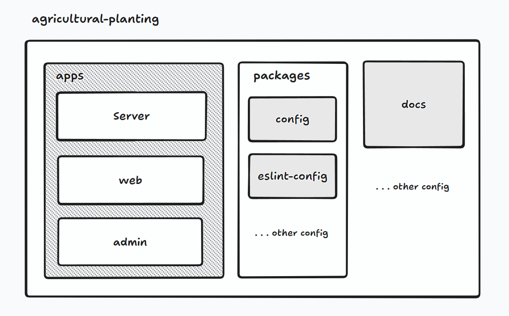

# Agricultural-Planting

[基于云计算平台构建智能温室种植平台(第十五届服创A18选题)](http://www.fwwb.org.cn/topic/show/a399bd45-8d61-4612-ac22-fe81724c7667)

> &nbsp;&nbsp;&nbsp;&nbsp;面对农村劳动力大量外流的现状，政策主张创新农业生产经营体制，发展家庭农场、大种植园和新型农民合作组织，支持龙头企业通过兼并、重组、收购和控股等方式形成大企业集团。通过建立农业产业化示范基地，发展促使龙头企业集群促进龙头企业与农民建立紧密的利益联动机制，采取保本收购、分红、利润回报等方式。同时加大资金支持农业产业化，支持龙头企业建设原料基地，节能减排，培育品牌。家庭农场、大型农业种植者和农民合作组织的形成和发展将加速智能温室作为这一项先进农业技术的推广和应用。这些新的农业经济体拥有资本、技术和人才，它们有能力利用智能温室的新技术来提高土地的单位产值，最大限度地提高家庭农场的效益。

## 在线预览 | Online Preview

[UI设计稿](https://mastergo.com/goto/wDnbiWJt?page_id=M&file=114928014033458)
[Web预览](https://demo.leostar.top/)
[Admin后台](https://demo.leostar.top/)
[开发文档](https://github.com/leostar/Agricultural-Planting/blob/main/docs/README.md)

## 技术栈 | Tech Stack

- [Turborepo](https://turbo.build/repo/docs)
- [NestJS](https://docs.nestjs.cn/)
- [Prisma](https://prisma.nodejs.cn/)
- [NextJS](https://www.nextjs.cn/)
- [Tailwind](https://tailwind.nodejs.cn/)
- [Typescript](https://www.tslang.cn/)
- [Jest](https://www.jestjs.cn/)
- [Playwright](https://playwright.nodejs.cn/docs/intro)
- [Rspress](https://rspress.dev/zh/guide/start/introduction.html)
- [Docker](https://docs.docker.com/get-started/overview/)

## 项目介绍 | Project Introduction


项目整体采用monorepo，包含三个子项目：`web`, `api`和`ui`以及`docs`文档。CI采用的是`github actions`，CI/CD流程如下：
- `docs`文档部署采用`github pages`,代码更新后会自动部署
- `web`和`api`项目构建完成之后，会自动触发`docker-compose`，将项目部署到`docker`中

### Web前台

技术栈

- [Next.js](https://nextjs.org)
- [React](https://reactjs.org/)
- [React Router](https://reactrouter.com/)
- [Redux](https://redux.js.org/)
- [Tailwind](https://tailwindcss.com/)
- [NextAuth](https://nextauth.js.org/)


### Admin后台

技术栈


### Server服务端

采用 [NestJS](https://nestjs.com/) 服务端

技术栈

- [Prisma](https://www.prisma.io/)

## 运行 | Running
- Install nps by running 
```
npm i -g nps
```
- Make sure docker and docker-compose are
 installed. Refer to docs for your operating system.

### 环境配置
- Frontend
    - `cd apps/web && cp .env.example .env`
- Backend 
    - `cd apps/api && cp .env.example .env`

## 贡献 | Contribute
